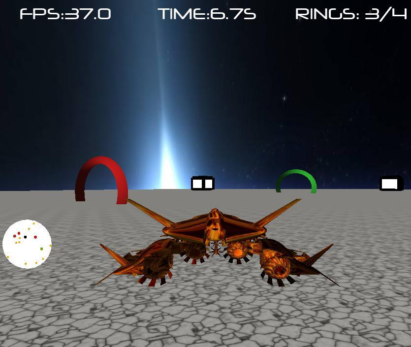
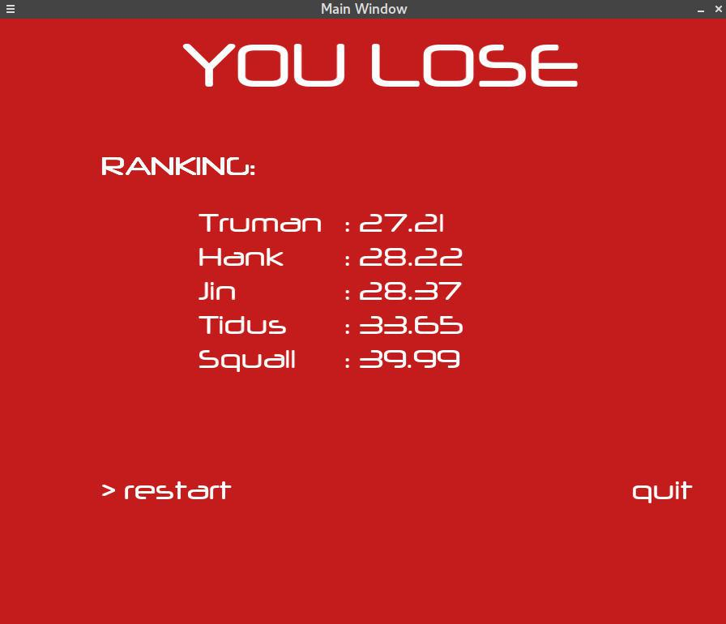
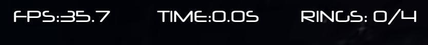
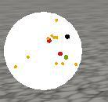
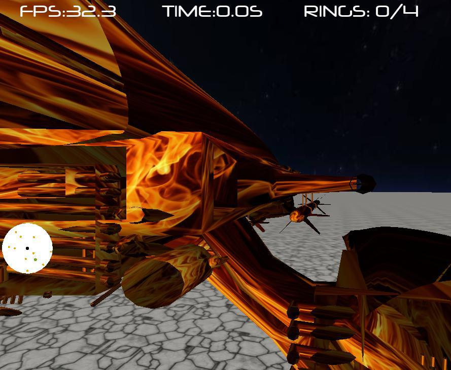
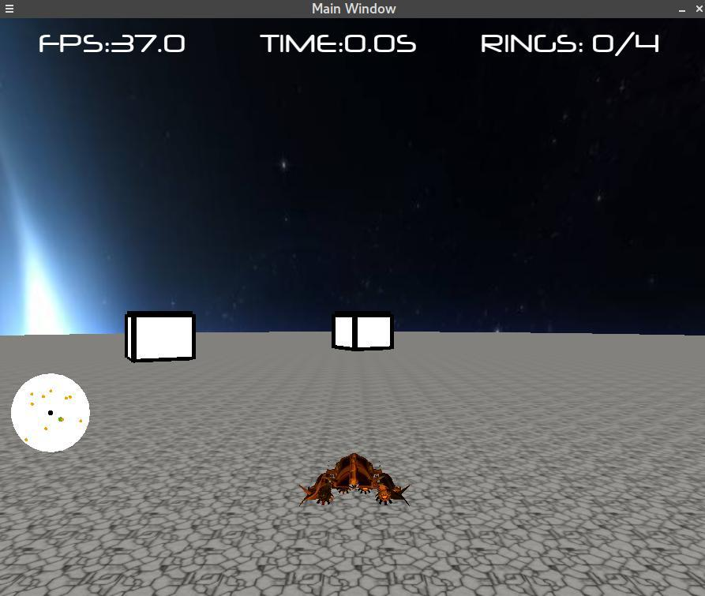
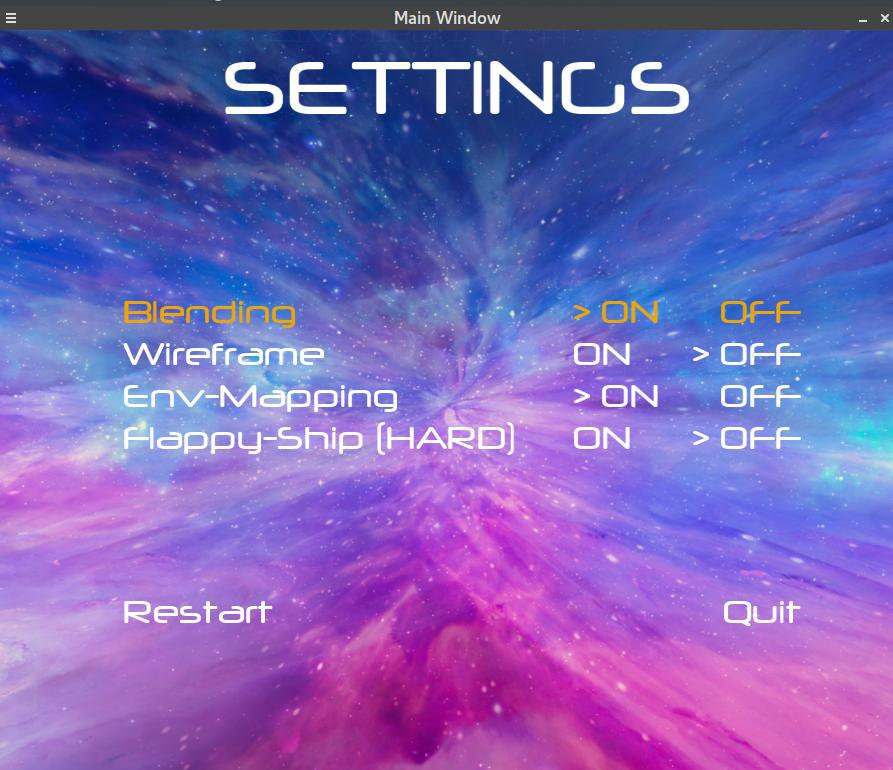
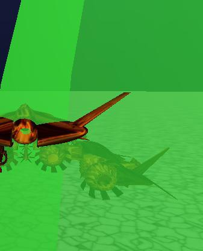
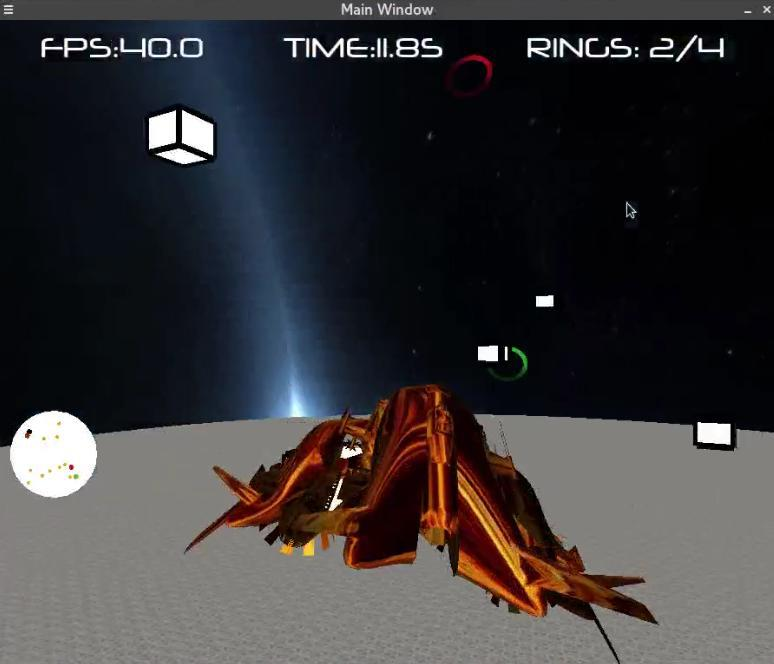

# Flappy Ship - An OpenGL 3D racing game
Welcome to the frenzy world of Flappy Sip, where there's no time to ponder but only to fly. Dive into a race against space-time! Will you be able to cross all the rings before the time runs out? 

## Notes
This game has been developed *mainly* as a project work for my university. Since it was a foundation class on CG, there was a very small introduction on shaders. Therefore the request was that the whole thing should rely on the *fixed* pipeline of OpenGL, now deprecated.
Nevertheless, I enjoyed messing around with it and the code has been designed to be modular and extensible. Ideally, it should be possible to update the whole graphics implementations without changing the API of the abstraction layer (Abstract GL, agl.h). 
For other technical details, see below. 

## Compilation Requirements 
To compile this code you'll need: 

* Linux
* make 
* a C++ compiler like gcc or clang: the code uses features C++11, so please make sure your compiler supports it (e.g. gcc 4.8.1 or higher) 
* an implementation of OpenGL (like Mesa)
* SDL 2.0 

## Start
To launch the game you need to provide the player name as an argument: 

```
./start_game <player name>
```
The player name will be used to keep the ranking of the best players of **Flappy Ship**. 

## Splash
The first thing that will appear is an artistic Splash screen.


## Gameplay
The purpose of the game is to cross all the **power rings** before the time runs out. At the top of the screen you can read the remaining time and you'll notice that everytime you cross a ring you will acquire a bonus time that will help you to reach the next ring.


If you cross all the rings then you will win, and a victory screen will appear; vice versa a defeat one will be displayed. 

## Game over
When you cross the last ring or the time runs out, you switch to the game over screen.
If you win the screen will be green:


otherwise red:


#### Ranking
The game maintains an updated ranking of **Flappy Ship**. If you win, the total time spent to cross all the rings is computed and saved in the `ranking.txt` file. On the final screen, you will see the top-5 scores.

### Power Rings
When crossed, the rings change color becoming red (the color of the point on the minimap changes as well); and a new ring is rendered and appears on the map in green.

### Evil Cubes
Evil cubes are obstacles that are scattered - again randomly - throughout the playing field. When crossed, a penalty shoots.

##### Penalty
The ship begins to blink indicating that we have slowed down for a handful of seconds. Flickering is achieved by changing the rendering mode every 200 milliseconds by alternating a normal rendering to a wireframe.


## HUD
TrueType font (see details below) is used to print a Head-Up display that contains the following information:
`FPS - Remaining Time - N. of Rings crossed`


## Minimappa
In the lower left there is a map showing the various elements of the game in different colors and the location of the spaceship in the playfield.
When the rings are crossed their respective dots change color with them, greens become reds.


## Cameras
By pressing `F1` you can change the camera during gameplay, there are 5 different modes:

**Retro - Details - Wide Angle - Pilot - Arbitrary**






## Settings
By pressing `ESC` you can access the settings at any time of the game and modify certain options. For each option, it is indicated whether it is active or not. Use the Up / Down arrows keys to navigate the menu, the selected option is highlighted in yellow. Once highlighted, you can set it to On/Off with the left/right arrows.
Moreover, when the menu is displayed the timer stops so that it can be used to pause the game. 


##### Wireframe
When this option is on, the whole environment - excepted made for the floor - is rendered in wireframes, i.e. only drawing the edges of the objects.


##### Mapping the environment
Enables the spherical environment mapping to achieve a more realistic rendering for surfaces, simulating the surrounding environmental reflection. When turned off from the Settings, the world will look much less realistic:


## Advanced options
#### Alpha Blending
Activate transparencies (default On) of power rings and evil cubes. 



#### Hard Mode: Flappy Flight! 
When you activate this option the game restarts in ** hard mode**. You'll find yourself in the same scenario but this time everything can fluctuate in the air, even our spaceship. By pressing the accelerator 'W' the ship will increase and will leap in the air; when no keys are pressed the ship is pulled down by gravity; when the brake 'S' is pressed the ship will accelerate downwards. The tip of the Ship is tilted according to the flight direction mimiking the famous smartphone game Flappy Bird, albeit in 3D.
Even rings and cubes will be scattered around the sky, so it will be more difficult to win.



___
# EASTER EGG
Just when you think you are familiar with this frenzy world, you will discover that there is a **hidden easter egg** that can only be activated in a way.
If you specify **`Truman`** as the player name, the game will start in a special mode.

# Truman Escape
This time the initial Splash will be different. The name already anticipates what the surprise is. The famous Truman finds himself again imprisoned within the ephemeral fiction of a spherical and finite universe (the universe of the game is indeed a sphere ...) and must escape.


The texture applied to the sky shows its image close to the stairs leading to freedom. The floor is covered with leaflets with his face.
Our spaceship was traded with the boat he used to flee in the movie, which has now acquired the ability to levitate!


## Final Door
This time it will not be enough to complete the crossing of all the rings. Once the last one is crossed, the secret door will appear, which is not marked on the minimap. Our job is to reach it and gain freedom. All this - of course - before the inexorable deadline comes.


---

## Technical features
OpenGL was used for all the graphics features and SDL to support events, peripherals, and windows.

### Graphics:
* Perspective view of the elements through a dynamically placed camera behind the ship, with variable distances depending on the type of camera you choose by pressing `F1`;
* Adaptive Vertical Synchronization *(VSync)* support;
* Illumination through the lights of OpenGL, specifically the environment is illuminated by GL\_LIGHT0;
* Support for **OBJ** Mesh loading, used for the shuttle, the boat and final door;
* Texture support used for floor, sky, boat, space shuttle and final door;
* TrueType font support for printing on the screen, through an atlas of pre-loaded textures;
* Spherical environment mapping;
* Possibility to activate transparencies by alpha-blending;
* Expansions: There is also the ability to draw shadows and headlights but this still have few bugs to fix at the moment.

### TrueType Font Rendering
The only way to use a TrueType font in OpenGL is to render each glyph as a texture, that is a killer barrier for performance.
For this reason, a small library was written that loads a chosen TrueType font chars atlas and saves it as a textures vector directly on the GPU. This pre-loading allows each letter to be rendered as a texture already in memory, circumventing the performance problem.
The [SDL\_ttf](https://www.libsdl.org/projects/SDL_ttf/docs/index.html) library was used to load individual glyphs.

### Software Design
The project consists of ~5000 lines of C++11. For this reason the code has been widely commented and I tried to keep it as modular as possible, even to favor future expansions. 
The architecture is based on asynchronous callbacks. I also tried to use the new C++ features available since 2011, such as novelties added to the standard library (e.g. smart pointers), lambda support and closures.

---
### Credits 
The real-time TTF rendering library has been inspired by the [GLKTextRenderer](https://github.com/ichigo663/GLKTextRenderer) library of my colleague Antonio Cardace. 
